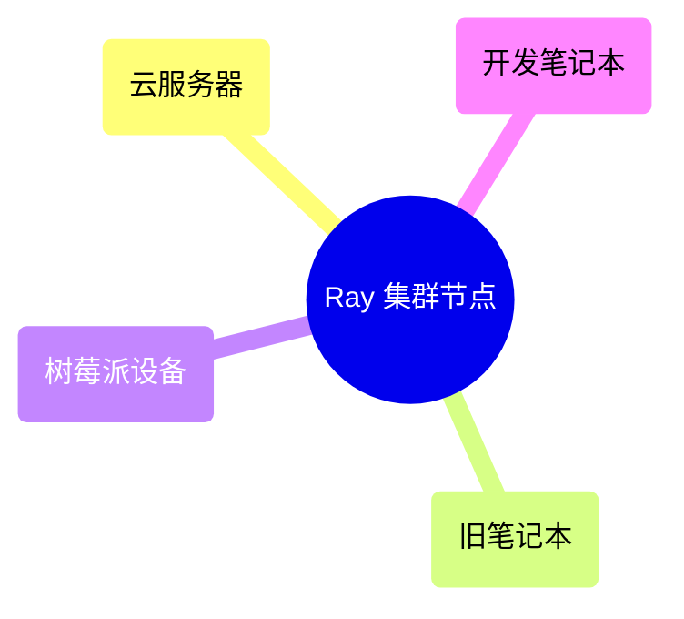
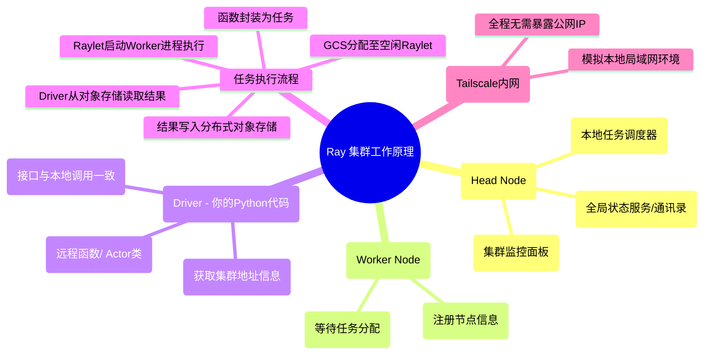

# Ray-Cross-Reg-Container-Cluster-Setup-Notes  
> 基于「笔记本-云服务器-宿舍设备」三段网络，通过 Tailscale 构建内网，实现7×24小时容器级自愈的 Ray 集群搭建全记录

## 1. 核心技术亮点  
- **零公网依赖**：纯 Tailscale 内网穿透，跨城市/校区设备即插即用，无需公网 IP  
- **自动自愈能力**：raylet 进程异常时10秒内自动重启，保障集群隔夜稳定运行  
- **极速部署**：Docker + 脚本化操作，3分钟内完成从0到2节点的集群搭建  
- **离线可用**：支持镜像保存与加载，无网络环境下也能快速分发运行环境  

## 2. 集群架构与工作原理  

### 2.1 集群节点构成  

### 2.2 集群工作流程  

